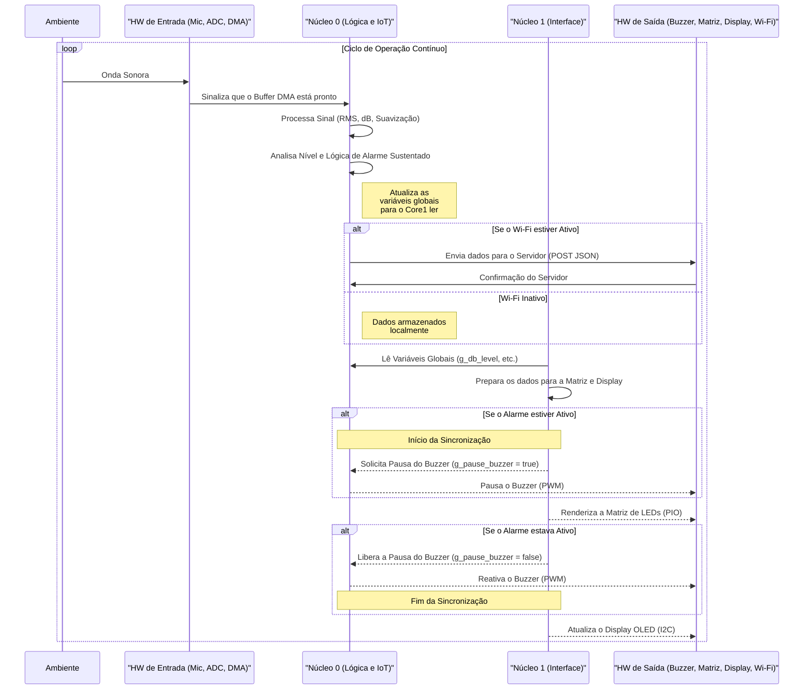

# Projeto Amostragem de Microfone com Display OLED no Raspberry Pi Pico

## 1. Descrição Geral

Este projeto demonstra como realizar a amostragem de um sinal de áudio de um microfone utilizando o Conversor Analógico-Digital (ADC) e o Acesso Direto à Memória (DMA) em um microcontrolador Raspberry Pi Pico. O sistema calcula a tensão RMS (Root Mean Square) do sinal capturado, converte essa tensão para um nível sonoro simulado em decibéis (dB) e classifica a intensidade sonora em categorias como "Baixo", "Moderado" ou "Alto". Todas essas informações são exibidas em tempo real em um display OLED SSD1306.

Este projeto foi desenvolvido com base nas funcionalidades de amostragem de microfone via DMA, similar ao encontrado no projeto `microphone_dma` de BitDogLab, adaptando-o para incluir a análise de intensidade sonora e a integração com um display OLED para visualização dos dados.

## 2. Funcionalidades Principais

- **Amostragem de Áudio:** Utiliza o ADC do Raspberry Pi Pico para capturar o sinal analógico do microfone.
- **Transferência DMA:** Emprega o DMA para transferir eficientemente as amostras do ADC para um buffer na memória, minimizando a carga na CPU.
- **Cálculo de Tensão RMS:** Processa as amostras de áudio para calcular a tensão RMS, uma medida da magnitude efetiva do sinal AC.
- **Conversão para Nível de dB Simulado:** Converte a tensão RMS em um valor de decibéis (dB) relativo, utilizando uma tensão de referência configurável.
- **Classificação da Intensidade Sonora:** Categoriza o nível de dB em "Baixo", "Moderado" ou "Alto" com base em limiares personalizáveis.
- **Exibição em Display OLED:** Mostra o título "Intensidade Sonora", o nível de dB calculado, a classificação da intensidade e avisos adicionais (como "Nível Prejudicial!") em um display OLED SSD1306 conectado via I2C.
- **Mensagens de Status:** Exibe mensagens de inicialização e configuração no display.

## 3. Estrutura do Projeto

O código fonte está organizado da seguinte forma:

- `src/amostragem_mic.c`: Arquivo principal contendo a função `main()`, inicializações e o loop de controle que coordena a amostragem, processamento e exibição.
- `src/utils/microfone/mic.h` e `src/utils/microfone/mic.c`: Módulo responsável pela configuração do ADC, amostragem do microfone, cálculo da tensão RMS, conversão para dB e classificação do nível sonoro.
- `src/utils/dma/dma.h` e `src/utils/dma/dma.c`: Módulo para configuração do canal DMA utilizado para a transferência de dados do ADC.
- `src/utils/displayOLED/display.h` e `src/utils/displayOLED/display.c`: Módulo para inicialização e controle do display OLED SSD1306, incluindo funções para limpar a tela, desenhar texto e atualizar o display.
- `CMakeLists.txt`: Arquivo de configuração do CMake para compilação do projeto com o Pico SDK.
- `pico_sdk_import.cmake`: Script CMake para importar o SDK do Raspberry Pi Pico.

## 4. Como Funciona a Medição de dB

O processo para estimar o nível de decibéis (dB) do ambiente envolve algumas etapas chave, desde a captação do som até os cálculos finais:

1.  **Captação e Amplificação:** O microfone na placa (que usa um amplificador MAX4466) captura as ondas sonoras e as converte em um sinal elétrico analógico. Este sinal é amplificado para que possa ser lido adequadamente pelo ADC.
2.  **Conversão Analógico-Digital (ADC):** O Raspberry Pi Pico utiliza seu ADC interno (com resolução de 12 bits) para converter o sinal analógico do microfone em valores digitais. A função `init_config_adc` prepara o ADC, selecionando o pino (GP28) e configurando a taxa de amostragem (via `ADC_CLOCK_DIV`) e o buffer FIFO.
3.  **Amostragem via DMA:** Para coletar os dados do ADC de forma eficiente sem sobrecarregar a CPU, usamos o DMA (Acesso Direto à Memória). A função `sample_mic` configura o DMA para transferir um número definido de amostras (`SAMPLES`, atualmente 2500) do FIFO do ADC para um buffer na memória (`adc_buffer`).
4.  **Cálculo da Tensão RMS (`get_voltage_rms`):** Esta é a etapa central do processamento:
    - **Remoção do Offset DC:** O sinal do microfone possui um componente DC (nível de tensão médio quando não há som). Calculamos a média de todas as amostras no buffer para encontrar esse offset.
    - **Isolamento do Sinal AC:** Subtraímos o offset DC de cada amostra para obter apenas o componente AC, que representa o som.
    - **Cálculo do RMS:** O RMS (Root Mean Square) é uma medida da magnitude efetiva do sinal AC. Calculamos usando a fórmula:
      $V_{rms\_digital} = \sqrt{\frac{1}{N} \sum_{i=1}^{N} (Amostra_{AC_i})^2}$
      Onde N é o número de amostras (`SAMPLES`).
    - **Conversão para Tensão:** Convertemos o valor RMS digital para uma tensão RMS real (em Volts), considerando a tensão de referência do ADC (3.3V) e sua resolução (12 bits):
      $V_{rms} = V_{rms\_digital} \times \frac{3.3V}{4096}$
5.  **Cálculo do Nível de dB (`get_db_simulated`):** Com a tensão RMS ($V_{rms}$), estimamos o nível de decibéis usando a fórmula padrão:
    $dB = 20 \times \log_{10}\left(\frac{V_{rms}}{V_{REF\_DB}}\right)$
    - $V_{REF\_DB}$ é uma **tensão de referência crucial para a calibração**. É o valor que _definimos_ como correspondendo a um nível de referência. Atualmente, estamos usando `0.00004f` (40µV). Ajustar este valor é a principal forma de calibrar as leituras do sistema com um medidor de dB real.
    - A função também aplica limites para garantir que o valor exibido permaneça dentro de uma faixa razoável (ex: não menor que `MIN_DB_DISPLAY_LEVEL` e não maior que 120 dB).
6.  **Classificação e Exibição:** Finalmente, o nível de dB calculado é classificado como "Baixo", "Moderado" ou "Alto" e exibido no display OLED.

Este processo nos permite obter uma estimativa da intensidade sonora do ambiente, que, embora não seja perfeitamente equivalente a um decibelímetro profissional (devido a fatores como ponderação de frequência e calibração precisa), fornece uma medida útil e relativa da intensidade sonora.

## 5. Calibração e Ajustes

Para obter leituras de intensidade sonora mais significativas e classificações adequadas ao seu ambiente e microfone, pode ser necessário ajustar algumas constantes definidas no arquivo `src/utils/microfone/mic.h`:

- **`V_REF_DB`**: Esta é a tensão de referência usada no cálculo de dB ($db = 20 * log10(voltage_rms / V_REF_DB)$).

  - Um valor menor de `V_REF_DB` resultará em valores de dB mais altos para a mesma `voltage_rms`.
  - Ajuste este valor para definir o "piso" de dB do seu sistema em silêncio. Por exemplo, se o silêncio resulta em 50dB e você deseja que seja 30dB, você precisará aumentar `V_REF_DB`. **Este é o principal fator de calibração.**

- **`LIMIAR_DB_BAIXO_MODERADO`**: Define o valor de dB que separa a classificação "Baixo" da "Moderado".
- **`LIMIAR_DB_MODERADO_ALTO`**: Define o valor de dB que separa a classificação "Moderado" da "Alto".
- **`SAMPLES`**: Aumentar este valor pode dar leituras mais estáveis, mas menos responsivas. Diminuir pode fazer o contrário.

**Processo de Calibração Sugerido:**

1.  **Escolha o Modo de Alimentação:** Decida se você vai usar predominantemente a bateria ou o USB, pois isso afeta o ruído de fundo. Calibre no modo principal.
2.  **Observe o Silêncio:** Coloque o dispositivo e um medidor de dB de referência no ambiente mais silencioso possível.
3.  **Ajuste `V_REF_DB`:** Modifique `V_REF_DB` até que a leitura de dB no silêncio na sua placa corresponda à leitura do medidor de referência (ou um valor desejado, ex: 35-40 dB). Lembre-se: `V_REF_DB` menor = dB maior; `V_REF_DB` maior = dB menor.
4.  **Teste com Sons:** Com o novo `V_REF_DB`, observe os valores para sons que você considera baixos, moderados e altos, comparando com o medidor.
5.  **Ajuste Fino:** Se necessário, faça pequenos ajustes em `V_REF_DB` para encontrar o melhor compromisso entre a precisão no silêncio e em volumes altos.
6.  **Ajuste Limiares:** Ajuste `LIMIAR_DB_BAIXO_MODERADO` e `LIMIAR_DB_MODERADO_ALTO` para que as classificações correspondam à sua percepção e às leituras calibradas.

## 6. Dependências

- Raspberry Pi Pico SDK
- Hardware I2C e ADC do Raspberry Pi Pico
- Biblioteca SSD1306 (geralmente incluída ou adaptada no projeto para o Pico)

## 7. Evolução do Projeto: Do Básico ao Sistema Multicore

Após a implementação inicial, o projeto passou por uma série de evoluções significativas para adicionar novas funcionalidades e aumentar sua robustez.

### 7.1. Calibração Avançada do Microfone

O microfone externo (MAX9814) foi conectado à entrada analógica da placa BitDogLab. A calibração foi um processo iterativo em duas etapas:

1. **Ajuste do Piso de Ruído:** A constante `V_REF_DB` em `src/utils/microfone/mic.h` foi ajustada para alinhar a leitura de dB em silêncio com um decibelímetro de referência.
2. **Ajuste da Faixa Dinâmica:** Como o microfone possui Controle Automático de Ganho (AGC) que comprime a faixa dinâmica, a fórmula de cálculo em `get_db_simulated` (no arquivo `src/utils/microfone/mic.c`) foi modificada para "esticar" a escala de dB, garantindo que os sons altos também correspondessem à referência. A fórmula final calibrada foi:

   ```
   db_level = 73.0f * log10f(voltage_rms / V_REF_DB) - 40.0f;
   ```

### 7.2. Alarme Sonoro e Lógica de Interface

Foi adicionado um buzzer para emitir um alarme sonoro quando o nível de ruído atinge a classificação "Alto". Para imitar a interface de aplicativos de decibelímetro, a ledbar foi ajustada para exibir faixas de cores (verde, amarelo, vermelho) de forma proporcional na matriz de 25 LEDs.

### 7.3. Transição para Arquitetura Multicore

A primeira implementação do alarme sonoro usava funções de sleep que eram bloqueantes, ou seja, "congelavam" todo o sistema enquanto o som era emitido. Isso fazia com que a matriz de LED e o display parassem de atualizar, o que era inaceitável para um sistema de monitoramento em tempo real.

Para resolver isso, o sistema foi refatorado para usar os dois núcleos do processador RP2040:

- **Núcleo 0 (main):** Ficou responsável pela lógica principal, incluindo a amostragem de áudio via DMA, o processamento dos dados e o controle do alarme sonoro.
- **Núcleo 1 (core1_entry):** Foi dedicado exclusivamente a atualizar a interface do usuário (matriz de LED e display OLED), garantindo que ela permanecesse fluida e responsiva, independentemente do que o Núcleo 0 estivesse fazendo.

A comunicação entre os núcleos é feita através de variáveis globais `volatile`.

### 7.4. Solução para o Congelamento da Interface (Conflito de Hardware)

Mesmo com a arquitetura multicore, a ativação do buzzer (que usa o periférico PWM) ainda causava o congelamento da matriz de LED (PIO). A causa foi identificada como um conflito de hardware de baixo nível, onde a alta frequência do PWM interferia com a temporização do PIO.

**Solução Implementada:** Foi criado um mecanismo de cooperação entre os núcleos. O Núcleo 1 (interface), antes de renderizar a matriz, sinaliza para o Núcleo 0 (lógica) pausar o buzzer por um intervalo de microssegundos. Essa pausa é inaudível, mas suficiente para o PIO transmitir os dados sem interferência, permitindo que o alarme e a ledbar funcionem simultaneamente sem travamentos.

### 7.5. Solução para a Instabilidade Visual (Salto para 30 dB)

O sistema ocasionalmente exibia uma leitura válida de som seguida por um "salto" para o valor mínimo de 30 dB, especialmente após um som alto e repentino, dando uma aparência instável.

**Solução Implementada:** A causa raiz foi rastreada até a ordem do processamento de sinal. A solução foi refatorar a lógica em `mic.c` para:

1. Calcular o dB "cru".
2. Limitar este valor a um piso seguro de 30 dB para evitar que números negativos extremos (do logaritmo) entrem no próximo passo.
3. Aplicar um filtro de suavização assimétrica ("ataque rápido, decaimento lento") ao valor já seguro, garantindo que a ledbar suba instantaneamente com o som e desça suavemente, resultando em uma visualização profissional e estável.

### 7.6 Calibração Precisa dos Microfones Interno e Externo

- Implementada calibração utilizando **referência de dB (`V_REF_DB`) ajustada experimentalmente** com base em comparações contra um aplicativo confiável de medição de decibéis.
- Ajustada fórmula de conversão para corrigir a diferença entre valores medidos no microfone da placa BitDogLab e no aplicativo de referência.
- Realizados testes com **níveis de silêncio, fala e palmas**, obtendo alinhamento próximo entre medidor externo e valores lidos pelo sistema.
- Calibração feita de forma **compatível para microfone interno (BitDogLab) e externo (MAX9814)**, garantindo que o mesmo código funcione para ambos sem ajustes adicionais.
- Inclusão de **offsets** e ajustes na escala para reduzir sensibilidade excessiva em picos sonoros.

### 7.7 Implementação de Filtro Anti-Pico (Histerese de Nível Sonoro)

- Adicionado sistema que **congela o nível de referência** (`db_antes_buzzer`) assim que o alarme é ativado, evitando aumentos abruptos por distorções ou saturação.
- Se o som aumentar mais de **+3 dB** em relação ao valor no momento da ativação do buzzer, o sistema limita a leitura ao valor anterior, evitando falsos alarmes e loops de feedback.
- Essa histerese atua apenas enquanto o alarme está ativo.

### 7.8 Lógica de Alarme Sustentado e Controle Contínuo do Buzzer

- Criada lógica para só ativar o alarme após **detectar nível "Alto" por um tempo contínuo configurável** (`TEMPO_ALARME_SUSTENTADO_S`).
- Previne disparos por ruídos breves e não prejudiciais.
- **Buzzer contínuo:** uma vez ativado, permanece ligado enquanto o nível permanecer "Alto".
- Desligamento automático quando o som retorna para níveis "Moderado" ou "Baixo".
- Todo o controle foi implementado no **núcleo 0**, garantindo leitura e decisão centralizada, sem travar a atualização gráfica do núcleo 1.

### 7.9. Evolução para um Sistema IoT Conectado

A transformação do sistema de monitoramento local para um dispositivo IoT totalmente conectado foi o maior desafio do projeto, revelando um problema complexo e sutil que não era aparente na operação offline.

#### 7.9.1. O Obstáculo: Falha Total com a Ativação do Wi-Fi

A tentativa inicial de adicionar a funcionalidade Wi-Fi resultou em uma falha completa e imediata do sistema. A placa tornava-se totalmente não responsiva assim que o código de inicialização do Wi-Fi era incluído — nem mesmo o LED de diagnóstico piscava, indicando um “Hard Fault” no momento da inicialização.

O processo de depuração explorou várias hipóteses, como:

- Consumo excessivo de memória pela pilha de rede.
- Tamanho insuficiente da pilha do segundo núcleo.
- Fragmentação de memória devido ao uso de `malloc()`.

Mesmo após aplicar otimizações nessas áreas, o problema persistiu, provando que a causa raiz era outra.

#### 7.9.2. O Diagnóstico Final: Conflito de Linkagem de Bibliotecas

Após uma depuração metódica, a causa do problema foi isolada: a ordem em que as bibliotecas de hardware eram linkadas no ficheiro de compilação `CMakeLists.txt`.

O linker, ao montar o programa final, estava juntando as bibliotecas de baixo nível (como `hardware_dma`, `hardware_adc`, `hardware_pwm`) antes das bibliotecas de sistema mais fundamentais (`pico_stdlib`, `pico_cyw43_arch_lwip_threadsafe_background`). Isso criava uma corrida por recursos no momento da inicialização do hardware. A biblioteca do Wi-Fi (que depende de timers, DMA e interrupções específicas) entrava em conflito com a inicialização dos outros periféricos, causando a falha fatal antes mesmo da execução da primeira linha do `main`.

#### 7.9.3. A Solução: Reorganização Estratégica no `CMakeLists.txt`

A solução definitiva foi simples e não exigiu alterações no código C do microcontrolador, nem otimizações de memória. Apenas a ordem das bibliotecas no comando `target_link_libraries` foi ajustada.

**Ordem anterior (instável):**

```cmake
target_link_libraries(iot-amostragem-mic
    hardware_i2c
    hardware_dma
    ...
    pico_stdlib
    pico_cyw43_arch_lwip_threadsafe_background
)
```

**Ordem corrigida (estável):**

```cmake
target_link_libraries(iot-amostragem-mic
    pico_stdlib
    pico_cyw43_arch_lwip_threadsafe_background
    pico_multicore
    hardware_dma
    hardware_adc
    hardware_i2c
    hardware_pwm
    ws2812b_animation
)
```

Ao garantir que as bibliotecas de sistema (`pico_stdlib`), conectividade (`pico_cyw43_arch_lwip_threadsafe_background`) e multicore (`pico_multicore`) fossem as primeiras a serem linkadas, a inicialização do sistema passou a ocorrer de forma estável e previsível, eliminando o conflito de hardware.

Esta descoberta foi crucial e demonstrou que, em sistemas embarcados, a configuração do build é tão importante quanto o próprio código da aplicação.

#### 7.9.4. Depuração Final da Comunicação com o Servidor

Após a estabilização da placa, a comunicação com o servidor Node.js foi rapidamente depurada:

- **Erro 404 Not Found:** corrigido ao ajustar o endpoint da requisição POST de `/` para `/dados-audio`, que era a rota que o servidor esperava.
- **Erro 400 Bad Request:** causado por um JSON malformado. A string de classificação de som (ex: `"Baixo"`) estava sendo enviada sem aspas. A solução foi ajustar a formatação da string no `printf` para `\"%s\"`, garantindo a conformidade com o padrão JSON.

## 8. Problemas Descobertos e Soluções Pendentes

Durante a transição para o sistema IoT, foi identificado um comportamento anômalo que persiste, mas que está relacionado ao hardware e não ao software.

### 8.1. Interferência no Microfone Externo com Wi-Fi Ativo

**Sintoma:** Enquanto o microfone interno da placa BitDogLab funciona perfeitamente, o microfone externo (MAX9814) apresenta uma queda drástica na sensibilidade quando o Wi-Fi está ativo. Os valores de RMS ficam presos em um "piso" baixo (resultando em leituras de ~30 dB), mesmo com o bloqueio de software (`cyw43_arch_lwip_begin/end`) implementado.

**Diagnóstico:** A solução de software foi eficaz para eliminar a interferência de radiofrequência (EMI), o que corrigiu o comportamento do microfone interno. No entanto, a persistência do problema no microfone externo aponta fortemente para ruído na linha de alimentação (3.3V). O chip Wi-Fi, mesmo com o rádio em silêncio, continua a consumir energia de forma ruidosa, e essa instabilidade é transmitida pelos fios de alimentação até o módulo do microfone externo, corrompendo o sinal analógico.

**Solução Pendente (Hardware):** A correção definitiva para este problema não está no software, mas sim no hardware. É necessário adicionar capacitores de desacoplamento (por exemplo, um de 0.1µF em cerâmica e um de 10µF eletrolítico) em paralelo entre os pinos VCC e GND do módulo do microfone externo. Estes componentes filtrarão o ruído da fonte de alimentação, fornecendo energia limpa para o microfone. Como esta é uma modificação física, ela fica pendente para uma próxima fase do projeto.

## 9. Diagrama de Sequência

Abaixo está o diagrama de sequência atualizado, refletindo a evolução do projeto, incluindo a lógica IoT, a cooperação entre núcleos e a comunicação com o servidor.



### Explicação Detalhada do Diagrama Atualizado

#### Captura e Processamento no Núcleo 0

- O hardware de entrada (microfone, ADC e DMA) captura o som ambiente e transfere os dados para o buffer DMA.
- O Núcleo 0 processa os dados, calcula o RMS, converte para dB e aplica a lógica de alarme sustentado.
- As variáveis globais são atualizadas para que o Núcleo 1 possa ler os dados.

#### Comunicação IoT

- Se o Wi-Fi estiver ativo, o Núcleo 0 envia os dados para o servidor como um JSON via POST e aguarda a confirmação.
- Caso o Wi-Fi esteja inativo, os dados são armazenados localmente para envio posterior.

#### Leitura e Preparação no Núcleo 1

- O Núcleo 1 lê as variáveis globais atualizadas pelo Núcleo 0 e prepara os dados para exibição na matriz de LEDs e no display OLED.

#### Lógica de Cooperação e Renderização

- Se o alarme estiver ativo, o Núcleo 1 solicita ao Núcleo 0 que pause o buzzer para evitar conflitos de hardware durante a renderização da matriz de LEDs.
- Após a renderização, o Núcleo 1 libera o buzzer, e o Núcleo 0 o reativa, se necessário.

Este diagrama reflete as evoluções do projeto, destacando a lógica IoT, a comunicação com o servidor e a cooperação entre os núcleos para manter o sistema responsivo e funcional.
